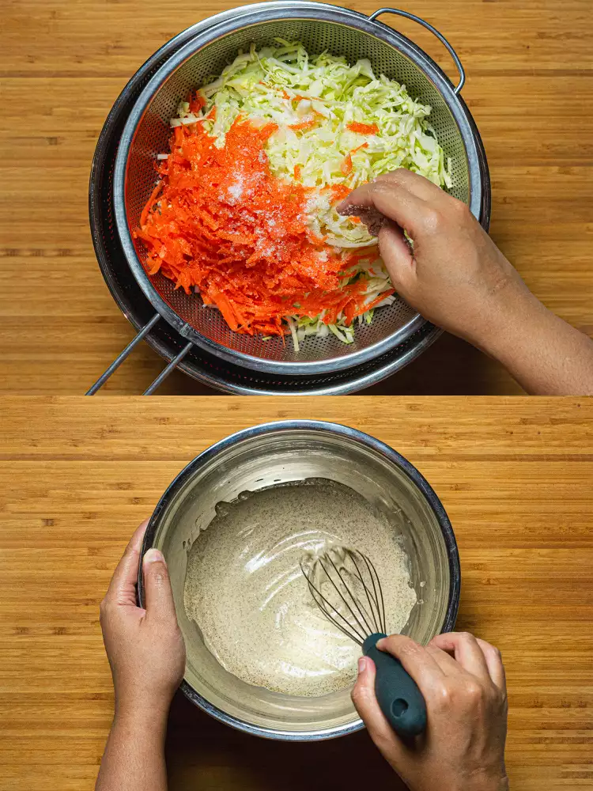
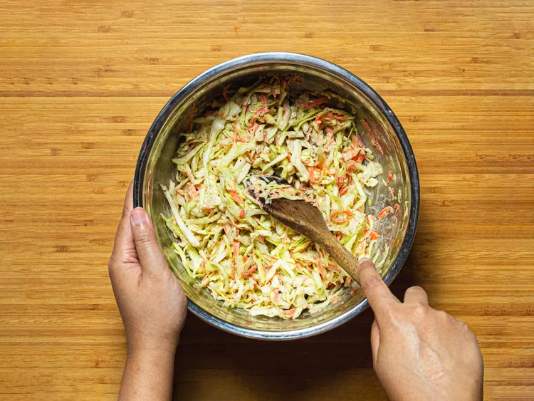

Tags: #chicken #beef #sandwich #main 
Source: [https://www.seriouseats.com/roti-john-malaysian-griddled-omelette-sandwich-8430704](https://www.seriouseats.com/roti-john-malaysian-griddled-omelette-sandwich-8430704)
Serves: 4
Time: 1h
Date: 22-01-2024  

## Ingredients

### Topping Option 1: Lettuces and Tomatoes

- 1 small head butterhead lettuce (8 ounces; 226g)
- 2 medium tomatoes (8 ounces; 226g), sliced 1/2-inch thick
- 4 tablespoons Malaysian-style chile sauce, such as Maggi 

### Topping Option 2: Cabbage and Carrot Slaw

- 1 small head green cabbage (1 1/2 pounds; 700g), quartered, cored, and shredded
- 1 medium carrot (3 ounces; 85g), peeled
- 1/2 cup granulated sugar (3 1/2 ounces; 100g)
- 1/4 cup (12g) Diamond Crystal kosher salt
- 5 tablespoons (75ml) mayonnaise
- 3 tablespoons (45ml) apple cider vinegar
- 1 tablespoon (7g) freshly ground black pepper4 tablespoons Malaysian-style chile sauce, such as Maggi (optional)

### Sandwich

- 1/4 cup plus 1 tablespoon (75ml) neutral oil such as vegetable or canola, divided
- 1 medium red onion (8 ounces; 226g), peeled and diced (about 3/4 cup)
- 8 ounces (226g) ground beef or ground chicken
- 1 tablespoon curry powder (see notes)
- 2 teaspoons Diamond Crystal kosher salt, divided, plus more as needed; for table salt use half as much by volume
- 6 large eggs
- 2 teaspoons freshly ground black pepper
- 2 tablespoons thinly sliced scallions, white and green parts
- 2 tablespoons Chinese celery leaves, chopped (optional)
- 2 tablespoons (28g) unsalted butter, softened
- 4 split hot dog buns
## Method

### Topping Option 1

1. Separate the lettuce leaves and transfer to a salad spinner. Wash leaves in cold water, then drain and spin dry. Set aside.

### Topping Option 2

1. Using the large holes of a box grater, shred the carrot. Place the cabbage and carrot into a large colander set in the sink and toss with the sugar and salt. Allow vegetables to macerate (stand) for 5 minutes. Meanwhile, in a large bowl, thoroughly whisk together mayonnaise, apple cider vinegar, and black pepper.

2. Rinse the cabbage and carrot under cold running water, then spin dry in a salad spinner. Transfer the vegetables to the large bowl with the mayonnaise dressing and toss to combine. (Note that this makes more slaw than you will need for the roti John; save the remainder to eat separately as desired.)

### Sandwich

1. In a large nonstick skillet, combine 1 tablespoon oil and onion and cook over medium-high heat, stirring often, until onions begin to soften, about 4 minutes. Add the ground meat, curry powder, and 1 teaspoon salt, and cook, stirring and breaking up the meat, until completely cooked through, about 4 minutes. Remove from heat and allow to cool, about 5 minutes.
2. Meanwhile, crack eggs into a medium bowl and whisk well with black pepper and the remaining 1 teaspoon salt. Scrape the onion and meat mixture into the eggs, along with scallions and Chinese celery leaves, if using. Stir well to combine and set aside. Wipe out skillet.
3. Spread butter on cut sides of each bun. Working in batches, toast the buns in the nonstick skillet, butter side down, over medium heat until lightly browned, 2 to 3 minutes. Set aside.
4. Wipe out the skillet. Heat 1 tablespoon oil in the pan over medium heat. Pour 1/4 of the omelette mixture into the pan and let cook, without stirring, for 10 seconds. Place one bun, toasted side down, into the egg mixture, then press bun lightly but firmly into eggs until egg sticks cohesively to the bun, about 20 seconds, while pushing the egg mixture towards the bread to prevent too much of an overhang. Allow omelette to continue to cook until browned, about 1 minute. Carefully insert a spatula between the egg and pan, then flip the whole thing over; using the spatula, flip any excessively overhanging omelette onto the bun. Toast top side of bun, checking often to prevent burning, 30 seconds to 1 minute. Remove Roti John from the pan and place on a wire rack set in a baking sheet. Repeat with remaining oil, omelette mixture, and toasted buns, wiping out skillet in between each sandwich.

5. Once all the sandwiches are cooked, top either with lettuce, tomatoes, and chile sauce or about 1/4 cup coleslaw per sandwich (with optional chile sauce, if desired). Close buns and slice each roti John crosswise into 2 to 3 segments. Serve immediately for the freshest bite, or wrap in parchment paper and let stand before consuming within 2 hours (the sandwich and its fillings will soften somewhat but I like how the flavors meld). Reserve remaining coleslaw or chile sauce for another use.
## Notes